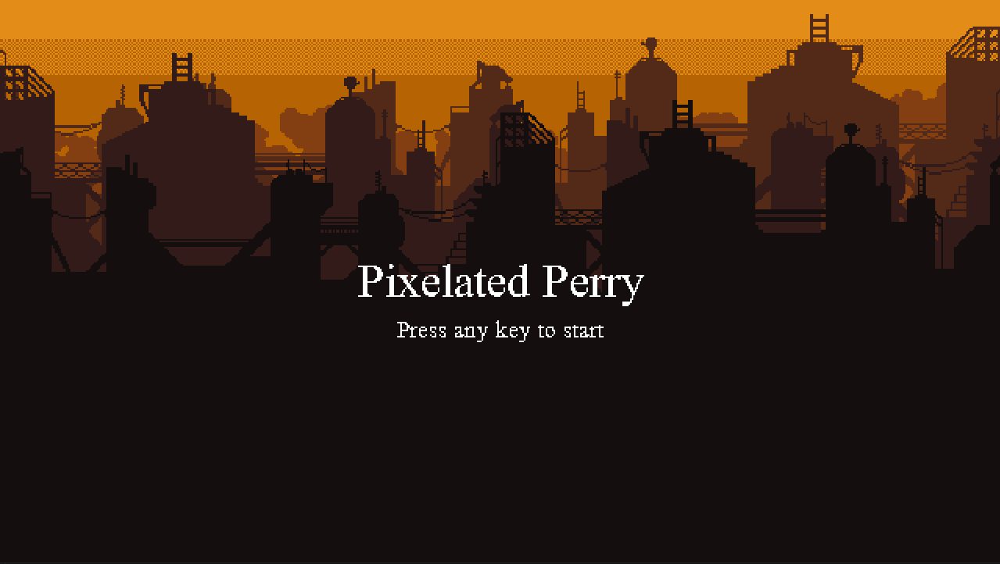
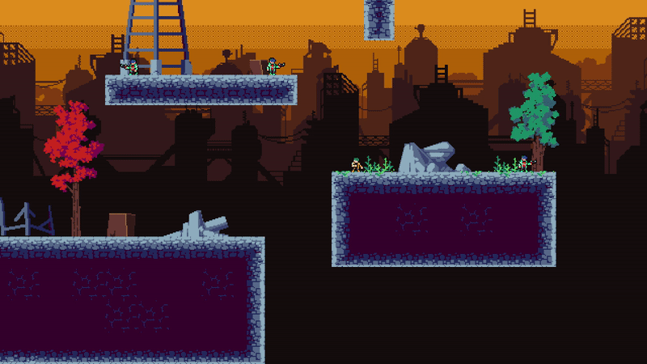

## Pixelated Perry
A 2D pixel-art platformer built in Python using Pygame. Make your way through increasingly challenging levels and defeat enemies along the way.

### Screenshots
**Title Screen**

**Movement & Level Transition**

**Death Animation**


### Features
- Platform Mechanics (run, jump, wall-slide/jump, dash attack)
- Sprite-based animation system
- Enemy AI
- Multiple levels with enemy spawns and goal points
- Visual Effects (Projectiles, Level Transitions, Screenshake)
- Start and End Screens

## Run the Game

### Requirements
- Python 3.8+

### Installation Instructions
```
git clone https://github.com/AmanvirSamra/2D-cyberpunk-platformer.git
cd 2D-cyberpunk-platformer
python pip install -r requirements.text
```

### Start the game
```
python .\game.py
```

## Controls

| Key      | Action                |
|----------|-----------------------|
| ← / →    | Move left / right     |
| ↑        | Jump                  |
| X        | Dash Attack           |
| R        | Restart (end screen)  |
| Any key  | Start game            |

## Project Structure
```
pixelated-perry/

├── data/
| └── maps/ # Level map JSON files
| └── images/
|    ├── tiles/ # Tile images
│    ├── entities/ # Player and enemy sprite sheets
│    ├── background/ # Background images
│    └── particles/ # Projectile assets
├── scripts/
│ ├── entities.py # Player, Enemy Classes
│ ├── tilemap.py # Tilemap handling
│ └── utils.py # Helpers for loading images/animations and levels
├── editor.py # Map Builder
├── game.py # Main game loop
├── README.md # This file
└── Requirements.txt # Python dependencies (e.g., pygame)
```

## Future Improvements
- Sound effects and music (In Progress)
- Map Builder (Partially completed - See below)
- More Enemy types and behaviours
- Heath System
- Gamepad & Voice Support

#### Running Map Builder
1. ⚠️ Currently, the map builder requires **manual editing of the code** to specify which level file to load or save.  
2. Open `editor.py` and modify the `MAP_ID` or file path variable near the top to match the level you're editing (e.g., `"data/maps/1.json"`).
3. If you're creating a new map, open the `data/maps` folder and check the highest number (e.g., `5.json`).  
   Then set the new file to the next number (e.g., `MAP_ID = 6`) to ensure it runs properly.

#### To start the editor
```
python .\editor.py
```

#### Controls

| Key      | Action                |
|----------|-----------------------|
| ← / →    | Move left / right     |
| ↑ / ↓    | Move up / down        |
| Left Click    | Place Tile        |
| Right Click    | Remove Tile        |
| X        | Toggle grid placement |
| S        | Save Level            |
| Scroll   | Switch Tile type      |
| Scroll+LShift   | Switch Tile variant  |

## Acknowledgments
- [Chroma-Dave](https://chroma-dave.itch.io/neon-city-pixel-art-pack-main-character-1) - For player and enemy sprites
- [CraftPix](https://craftpix.net/) - For Tile and background images
- [Pygame Community](https://www.pygame.org/) - For helpful documentation and tools
